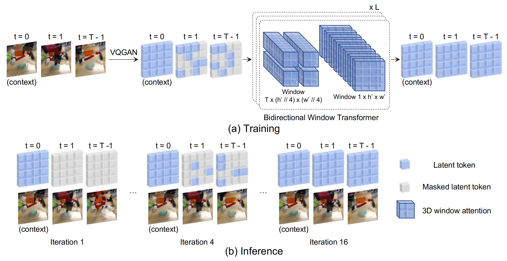

# MaskViT: Masked Visual Pre-Training for Video Prediction 

**<a href=""> MaskViT: Masked Visual Pre-Training for Video Prediction</a>**
 
<a href="http://web.stanford.edu/~agrim/">Agrim Gupta</a>,
<a href="https://s-tian.github.io/">Stephen Tian</a>,
<a href="https://cs.stanford.edu/~yzzhang/">Yunzhi Zhang</a>,
<a href="https://jiajunwu.com/">Jiajun Wu</a>,
<a href="https://robertomartinmartin.com/">Roberto Martín-Martín</a>,
<a href="http://vision.stanford.edu/feifeili/">Fei-Fei Li</a>
 

The ability to predict future visual observations conditioned on past observations and motor commands can enable embodied agents to plan solutions to a variety of tasks in complex environments. This work shows that we can create good video prediction models by pre-training transformers via masked visual modeling. Our approach, named MaskViT, is based on two simple design decisions. First, for memory and training efficiency, we use two types of window attention: spatial and spatiotemporal. Second, during training, we mask a *variable* percentage of tokens instead of a *fixed* mask ratio. For inference, MaskViT generates all tokens via iterative refinement where we incrementally decrease the masking ratio following a mask scheduling function. On several datasets we demonstrate that MaskViT outperforms prior works in video prediction, is parameter efficient, and can generate high-resolution videos ($256\times256$). Further, we demonstrate the benefits of inference speedup (up to $512\times$) due to iterative decoding by using MaskViT for planning on a real robot. Our work suggests that we can endow embodied agents with powerful predictive models by leveraging the general framework of masked visual modeling with minimal domain knowledge. 

</img>

